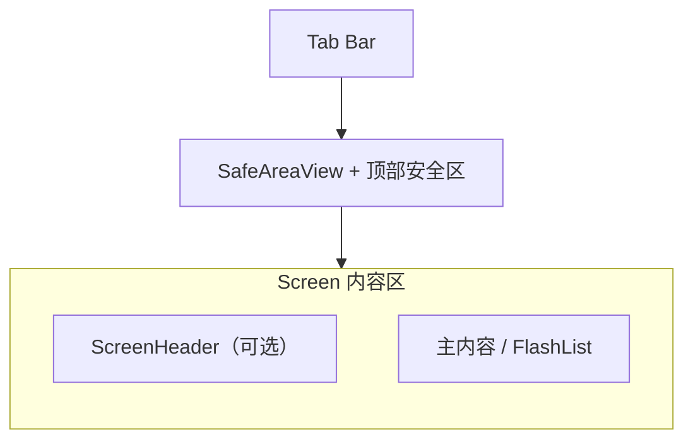

# 工程规范 · 质量与体验（Engineering: Quality）

> **SDD 定位**：代码约定、技术债与风险、页面壳层与测试/CI；与 `openspec/changes/*/SPEC.md` 的验收契约互补。  
> **系统与集成**（目录树、栈、Supabase/Groq）见 [`engineering-system.md`](./engineering-system.md)。  
> **领域契约**仍以 [`data-models.md`](./data-models.md)、[`state-management.md`](./state-management.md)、[`ui-components.md`](./ui-components.md) 为准。

---

## 1. 代码规范（摘要）

**Agent / Cursor 执行**：与仓库根目录 [`.cursor/rules/karpathy-guidelines.mdc`](../.cursor/rules/karpathy-guidelines.mdc) 一致（先澄清假设、最小改动、手术式编辑、可验证收尾）；与 [AGENTS.md](../AGENTS.md)「Agent 执行基线」及本节下文约定一并遵守。

**语言**：TypeScript `strict`；`any` 仅临时；优先 `interface` / `type`；导出 API 显式标注返回类型。

**命名**：组件 `PascalCase`；变量/函数 `camelCase`；常量 `UPPER_SNAKE`；布尔 `is/has/should` 前缀；事件 `onXxx`；自定义 hook `useXxx`。

**导入**：`@/` 别名；顺序：外部 → 空行 → `@/` → 相对 → 类型 `import type`；未用即删。

**变更收尾**：替换数据流、公共 API 或 UI 行为后，删除旧 action、类型、导出与死分支；全仓库搜索旧符号确认无引用，再提交。Agent 改代码时默认在同一 diff 内完成清理，避免残留「半套旧逻辑」。

**组件**：函数组件 + hooks；复杂 UI 拆子组件；`styles` 工厂放 `styles/components/*.styles.ts`；列表优先 `FlashList`。

**Store**：业务经 `useAppStore` action；selector 精确字段；不直接 mutate 嵌套对象。登录/冷启动恢复会话时须先尝试 `migrateGuestDataToUser`（游客键并入用户键）；登出/注销时用当前 `entries` 快照**覆盖** `mood_entries_guest`，不与旧游客数据合并。

**错误**：用户可见错误经 `utils/errorHandler.ts`；异步 `try/catch`。

**日志**：`utils/logger.ts` 经 `isDevelopment()` 在开发环境输出到控制台；新代码优先 `logger.warn` / `logger.error`（`services` / `shared` 等无 store 依赖处可直接用）。存量与紧急路径仍可见 `console.error` / `console.warn`；**信息级**避免在生产包刷屏，用 `__DEV__ && console.log` 或 `logger`。`Logger.persistLog` 为**刻意不实现**（未接 Sentry/本地错误日志文件前仅占位），见 `utils/logger.ts`。

**Git**：分支 `YYMMDD-(feat|fix|chore|refactor)-描述`；Conventional Commits；PR 小步、附验证说明。

**iOS 原生权限文案（NAT-01）**：系统弹窗走 `app.json` 的 `expo.locales` → `locales/native/{en,zh}.json`（`NS*UsageDescription`）；与 runtime `i18next` 独立。改 native JSON 或 `CFBundleAllowMixedLocalizations` 后须 `expo prebuild --clean` 并重装 dev build 再验 en 设备权限对话框。

**E2E 选择器（QA-01）**：关键控件用稳定 `testID`（见 `openspec/changes/WORKTREE-2026-06.md` E2E testID 表）；Maestro 用深链 `emotiondiary://…` + `id:` 选择器，勿依赖 Tab 文案 tap。React Native `Alert.alert` 按钮无 `testID` — Maestro 确认用 `tapOn index: 1`（cancel=0），Playwright Web 用 `page.on('dialog', accept)`。

**依赖边界**（`eslint-plugin-boundaries`）：`app` → `components`/`features`/`store`/`hooks`/`services`/`utils`；`store` 禁引 `components`；`services` 禁引 `components`/`store`；`utils` 仅纯函数与类型。

---

## 2. 技术债与风险

> 历史修订记录以 **git** 为准；本节只保留当前需知条目。

### 2.1 严重（C）与高（H）风险摘要

| ID | 主题 | 状态摘要 |
|----|------|----------|
| C1 | 云端删除与墓碑 | `purgeEntryForever` 经 `insertEntryTombstone` 登记墓碑；`syncToCloud`/`syncFromCloud` 过滤并物理删云；普通 `deleteEntry` 不写墓碑（007） |
| C2 | 注销与音频 | Edge `delete-account` 与客户端清理需保持契约一致 |
| H1 | 同步冲突 | 多设备并发近似「最后写入优先」；无版本向量。`syncFromCloud` 对同 id **以云端行为准**；`syncToCloud` 为全量 upsert 本地当前 `entries`（墓碑 id 除外）。Profile「备份到云端 / 从云端合并」文案与确认框见 `constants/syncDataOps.ts`、`changes/004-sync-ux-clarity`；互斥锁 `shared/sync/syncLock.ts` |
| H2 | 音频失败 | `uploadAudioWithRetry` 指数退避（`shared/audio/uploadRetry.ts`）；耗尽标 `failed`；备份含 pending+failed；条目内可重试（`retryAudioUpload`） |
| H3 | 大列表 | `getItemType` + `filterDashboardEntries`（008）；播放进度仅活跃卡片订阅 |
| H4 | SecureStore | Token 过大可能失败；已压缩 session |
| H5 | AI 成本/可用性 | Groq 限流；缓存 TTL 见 `store/modules/ai.ts`。**i18n v1.3**：AI 内存缓存 key 须 `loc:{AppLocale}:` 前缀（`utils/aiService.buildAiCacheKey`）；`setLocale` / `setLocaleMode` 须调用 `clearAiCache()` 并清空 forecast/podcast store 态（D-103–D-104） |
| H6 | 天气 | 缓存偏旧；错误降级静态文案 |
| H7 | 依赖升级 | Expo 大版本需对照官方迁移 |

### 2.2 中 / 低（摘要）

- **M1–M6**：类型收紧、大组件拆分、魔法字符串常量化、重复天气逻辑抽取、Insights 首屏下 deferred 挂载（`InsightsDeferredSections` · 008）、测试补齐（PR CI 已跑 `yarn test`，见 `.github/workflows/ci.yml`）。  
- **M7（录音 clipHandler）**：多挂载点须 `clipBinding` + `releaseRecordingClipHandler`；详见 §2.3。  
- **L1–L3**：死代码清理、JSDoc、主题 token 统一。  
- **脆弱区**：`useAppStore.ts` 同步与初始化、`shared/audio/recordingCoordinator.ts`、`audioSync.ts`、`aiService.ts`、`lib/supabase.ts`。  
- **安全**：Supabase RLS、anon key 可暴露、Groq key 仅客户端占位须防滥用；音频 URI 校验防路径遍历。  
- **建议**：同步状态机、Sentry、重试退避、图片压缩等见 backlog；以 SSD `SPEC` 排期。

### 2.3 录音协调：`clipHandler` 单例与多挂载面（问题、方案与质量）

**背景**：`shared/audio/recordingCoordinator.ts` 在进程内维护**单一**原生 `Recorder` 引用与**单一** `clipHandler`（录音结束后的片段投递到表单列表）。`RecordingSessionHost` 负责注入 recorder；各 `AudioRecorder` 通过 `setRecordingClipHandler` / `releaseRecordingClipHandler` 竞争该回调。

**曾出现的问题**：「记一笔」Tab 上的 `AudioRecorder` 长期挂载；编辑弹层/嵌入编辑里也有 `AudioRecorder`。若编辑实例在 `useEffect` 清理里直接 `setRecordingClipHandler(null)`，会在**卸载编辑 UI 时**把全局 handler 清空，而记一笔实例的 effect 依赖为 `[]` **不会重跑** → 原生仍可录，但**片段无法写回当前表单**（用户感知为「编辑后再去记一笔录音失败」）。

**解决方案（约定）**：

1. **`releaseRecordingClipHandler(handler)`**  
   仅当 `clipHandler === handler` 时才置 `null`，避免 A 卸载误清 B 已注册的回调。

2. **`AudioClipBinding`（`components/AudioRecorder/AudioRecorder.tsx`）**  
   - **`"tab-focus"`**（默认）：配合 `useIsFocused()`，仅当该屏在导航树中**获得焦点**时注册；失焦时释放。记一笔创建流用此模式，离开 Tab 或上层 Stack 盖住时不会长期霸占回调。  
   - **`{ active: boolean }`**：由父组件显式控制（如 `EntryEditor` 编辑模式用 `editVisible`），仅在弹层可见时注册。

3. **`EntryEditor`**：创建路径 `clipBinding="tab-focus"`；编辑嵌入路径 `clipBinding={{ active: editVisible }}`。

4. **与 `forceCancelRecording` 的配合**：`hooks/useStopAudioOnTabBlur.ts` 等仅在**失焦**路径取消录音，避免与长按 `pressIn` / arm 序列产生竞态（不在「进入记一笔」时无条件 `forceCancelRecording`）。

**涉及文件**：`shared/audio/recordingCoordinator.ts`、`components/AudioRecorder/AudioRecorder.tsx`、`components/EntryEditor/EntryEditor.tsx`、`hooks/useStopAudioOnTabBlur.ts`；全仓库仅 `EntryEditor` 引用 `AudioRecorder`，新增第二挂载点前须复查 binding。

**方案代码质量（评审摘要）**：

| 维度 | 说明 |
|------|------|
| **正确性** | 所有权语义清晰：「谁 active 谁注册」+ 释放时比对引用，消除跨实例误清类 bug。 |
| **可维护性** | `AudioClipBinding` 将隐式全局竞争显式化；默认 `tab-focus` 降低调用方遗漏概率。 |
| **与导航耦合** | `"tab-focus"` 依赖 `@react-navigation/native` 的 focus；若未来出现非导航容器内的录音 UI，须改用 `{ active }` 或等价信号。 |
| **扩展性** | 仍为单例回调模型；若出现第三个并发表单，需再次明确「同时只有一个接收方」的产品规则，或考虑更大重构（如片段先进 store、UI 只读投影）。 |
| **测试** | 协调器释放逻辑适合单测；完整手势链仍以设备/手工验证为主。当前 Jest 套件已通过；建议在回归清单保留「编辑 → 关闭 → 记一笔录音」路径。 |

---

## 3. 页面与布局（UI Shell）

### 3.1 壳层结构（概念）

**Android 导航栏**：`app/_layout.tsx` 使用 `expo-navigation-bar` 将按钮设为「对比色」并 `setVisibilityAsync('visible')`，避免与 Tab 重叠。

### 3.2 全局与双平台

- **全屏**：`+not-found`、部分 `profile` 子页使用 `Screen` 全屏；`edges` 按页裁剪。  
- **Keyboard**：表单屏 `KeyboardAvoidingView` + `keyboardShouldPersistTaps="handled"`。  
- **Modal**：`transparent` + 底部滑入；避免与 `navigation-bar` 争位。

### 3.3 按屏要点

| 区域 | 要点 |
|------|------|
| Tabs 三屏 | 列表/表单/洞察；各自 `Screen` + `ScreenHeader` 或内嵌头部 |
| Profile | 长表单滚动；`GroupedSettingsCard` 分组列表（010）；子路由返回栈清晰 |
| 回收站 | `app/recycle-bin.tsx`；`RecycleBinEntryCard` 只读卡 + 文字操作行（010） |
| Review Export | 导出前校验；大列表注意内存 |

---

## 4. 测试与 CI

**框架**：Jest + `ts-jest` + `@testing-library/react-native`；`jest.setup.js` 已 mock `expo-router`、Reanimated、SecureStore、`@shopify/flash-list`。

**原则**：不联网；不跑真实 Supabase；`useAppStore.getState()` 重置；时间 fake timers；FlashList `renderItem`/`estimatedItemSize` 可测。

**目录**：`__tests__/unit/**` 镜像 `utils/` / `store/` / `shared/` / `hooks/`。

**命令**：`yarn test`（Jest 排除 `e2e/`，Playwright 用 `yarn test:e2e`）；单文件 `yarn test __tests__/unit/...`。

**E2E**：Expo Web 回收站主路径见 `e2e/`（Playwright，`yarn test:e2e`）；iOS/Android 原生全链路见 `.maestro/flows/`（Maestro，`yarn test:maestro`，需 [Maestro CLI](https://maestro.mobile.dev)、模拟器已 Boot、`yarn start`、且已通过 `yarn ios` 安装与当前依赖一致的 dev build `com.moyunzero.emotiondiary`）。Xcode SDK 与 Simulator runtime 不一致时先 `bash scripts/maestro-preflight.sh` 诊断。

**CI**（`.github/workflows/ci.yml`）：PR 上 `yarn typecheck` → `yarn lint` → `yarn test`；push `master` 额外 `yarn verify:governance`（含 smoke）。详见根目录 `AGENTS.md`。

---

*合并自原 `CONVENTIONS`、`CONCERNS`、`UI-LAYOUTS`、`TESTING` 核心条目；长表与修订史已压缩。*
